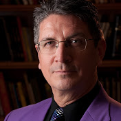

"[Daryl](https://en.wikipedia.org/wiki/Daryl_(magician)) *(August 13, 1955 - February 24, 2017)* was the professional name of *Daryl Easton*, (formerly *Daryl Martinez*), an American magician based in Las Vegas.
In his marketing he used the self-proclaimed title of "*The Magician's Magician*".
Daryl usually went by his forename only.
"

A ***really*** friendly, houmorous (and **devilish** clever) guy - and rightfully a worldchampion in his craft.

Hint: Check him out @ [YouTube](https://www.youtube.com/results?search_query=Daryl%27s+magic) or go straight to beauties such as

- [Daryl's Ambitius Card](https://www.youtube.com/watch?v=w4iu5FMaR2o)
- [Daryl's Magic Ropes](https://www.youtube.com/watch?v=W5W51GmM0I8)
- [Daryl's Chicago Opener](https://www.youtube.com/watch?v=JeIi5So5vwc)
- [Daryl's Psychological Force](https://www.youtube.com/watch?v=76vgDz6beO8)
- [Daryl's Face Up Locator](https://www.youtube.com/watch?v=QHE8lYbjMm0)
- [Circus Card Trick Daryl Easton](https://www.youtube.com/watch?v=3t_3jOZ6Fjs)
- [Ultra Monte](https://www.youtube.com/watch?v=kMLCmIGywJY)
- [The Full Monte - ](https://www.youtube.com/watch?v=Ok_WJL7N3L8)
- [Daryl shows us a card trick](https://www.youtube.com/watch?v=M9MYatxrXUk)
- [3 Fly III by Daryl](https://www.youtube.com/watch?v=yvHlL5WlaDQ)
- [The (W)hole Thing by Daryl](https://www.youtube.com/watch?v=BKtmfdfJ6os)

It's been **great honour** and **big fun** to meet with him and to e.g. translate him simultaneous into German during some of his lecture tours - some years ago.
Daryl: We miss You!

